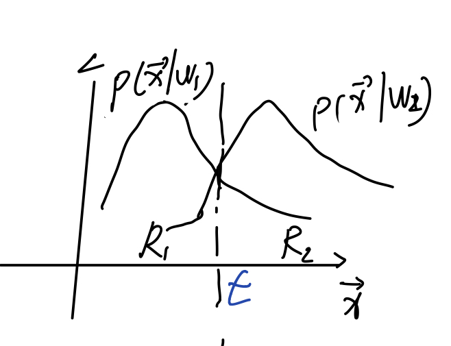

## 两类错误率
* 问题：是哪两类？  

研究两类错误率，将样本分为阳性（正样本）和阴性（负样本）；那么将样本分错就有两类情况，一是将阳性样本分成了阴性（即假阴）；二是将阴性样本分成了阳性（假阳）；

我们通过表格的形式来反应**实际**类别和**预测**的类别之间的关系：
|        | 阳性（实际）    | 阴性（实际）    |
| ------ | ------ | ------ |
| 阳性（预测）    | 真阳性（TP）  | 假阳性（FP）  |
| 阴性（预测）   | 假阳性（FN）  | 真阴性（TN）  |

在这里错误的分类有两种，FP和FN。在这里如果我们统计假阳样本占总的阴性样本的比例，就得到了第一类错误率（type-I error）：假阳性率=$\frac{FP}{TN+FP}=\alpha$；  
同理我们统计假阴性样本占总的阳性样本的比例，就得到了第二类错误率（type-II error）：假阴性率=$\frac{FN}{TP+FN}=\beta$。  

对应的有两类错误率，我们也可以定义**两类正确率**，即特异度（Specificity）= $S_p = \frac{TN}{TN+FP} = 1-\alpha$ ; 灵敏度（Sensitivity）= $S_n = \frac{TP}{TP+FN} = 1-\beta$ ; $S_n和S_p$用来评判分类结果在各类的**正确性**。

### 其它分类效果评估指标
正确率（Accuracy）：ACC = (TP+TN)/(TP+FP+TN+FN)  
召回率（Recall）：Rec = $S_n$ = TP/(TP+FN)  
精度（Precision）：Pre = TP/(TP+FP)；表示预测的准不准  
F度量（F-measure）：F = 2Rec*Pre/(Rec+Pre)；召回率和精度的调和平均  

### Neyman-Pearson决策
保证某一类错误率为一个固定的水平，在此前提下再考虑另一类错误率尽可能低。假设阳性代表有病，阴性代表没病。则第一类错误率：假阳性率，表示把没病的说成有病；第二类错误率：假阴性率，把有病的说成没病；显然这里的第二类错误率影响更严重，因为如果把有病说成没病，就会使病人错过进一步的治疗，按照最小风险贝叶斯决策的说法就是风险损失更大。  
所以常需要保持假阴性率为一个固定的水平$\sigma_0$, 在此前提下再追求第一类错误率尽可能低。  
设$\omega_1$类为阴性，$\omega_2$类为阳性，错误率为
$$ P(e) = \begin{cases} P(\omega_2|\mathbf{x}) \quad \mathbf{x} \in \omega_1 \\ P(\omega_1|\mathbf{x}) \quad \mathbf{x} \in \omega_2\end{cases} $$

假设样本的类条件概率密度$P(\mathbf{x}|\omega)$, 如下图所示，其中$R_1$和$R_2$是决策区域。  

  
  
图一

则定义错误率为
$$P(e) = P(\mathbf{x} \in R_1, \omega_2) + P(\mathbf{x} \in R_2, \omega_1)$$
$$=> \quad = P(\mathbf{x} \in R_1|\omega_2)P(\omega_2) + P(\mathbf{x} \in R_2|\omega_1)P(\omega_1) $$
$$=> \quad = P(\omega_2)\int_{R_1} P(\mathbf{x}|\omega_2)d\mathbf{x} + P(\omega_1)\int_{R_2} P(\mathbf{x}|\omega_1)d\mathbf{x} $$
$$=> \quad = P(\omega_2)P_2(e) + P(\omega_1)P_1(e) \quad \tag{1}$$

其中，$P_1(e)$代表第一类错误率（假阳性率），$P_2(e)$代表第二类错误率（假阴性率）。

Neyman-Pearson决策准则为：
$$ \min P_1(e) \\
s.t. \quad P_2(e) = \sigma_0 \quad \tag{2}
$$

解上述条件极值问题，采用拉格朗日乘子法，把上式的有约束极值问题转化为：
$$ \min \gamma = P_1(e) + \lambda(P_2(e) - \sigma_0) \quad \tag{3}$$
$$ => \quad \gamma = \int_{R_2} P(\mathbf{x}|\omega_1)d\mathbf{x} + \lambda(\int_{R_1} P(\mathbf{x}|\omega_2)d\mathbf{x} - \sigma_0) \quad \tag{4}$$
又因为
$$ \int_{R_2} P(\mathbf{x}|\omega_1)d\mathbf{x} = 1 - \int_{R_1} P(\mathbf{x}|\omega_1)d\mathbf{x} \quad \tag{5}$$
将其代入式（4）得：
$$ \gamma = 1 - \int_{R_1} P(\mathbf{x}|\omega_1)d\mathbf{x} + \lambda \int_{R_1} P(\mathbf{x}|\omega_2)d\mathbf{x} - \lambda\sigma_0 $$
$$ => \quad = 1 - \lambda\sigma_0 + \int_{R_1}[\lambda P(\mathbf{x}|\omega_2)-P(\mathbf{x}|\omega_1)]d\mathbf{x} \quad \tag{6} $$

由上图一可知，$R_1$与$R_2$由决策面$\mathbf{x}=t$分割，所以$\min \gamma$，就是求解使$\gamma$最小的t，$\gamma$是关于$\lambda$和t的函数。
$$ \frac{\partial \gamma}{\partial \lambda} = -\sigma_0 + \int_{R_1}P(\mathbf{x}|\omega_2)d\mathbf{x} = 0 \quad \tag{7}$$
$$ \frac{\partial \gamma}{\partial t} = \lambda P(\mathbf{x}|\omega_2) - P(\mathbf{x}|\omega_1) = 0 \quad \tag{8}$$
$$ => \lambda_0 = \frac{P(\mathbf{x}|\omega_1)}{P(\mathbf{x}|\omega_2)} \quad \tag{9}$$

同时当$t=t_0$为$R_1$和$R_2$的决策面时, 使得式（8）$\lambda P(\mathbf{x}|\omega_2) - P(\mathbf{x}|\omega_1) = 0$成立, 同时观察式（6），要使得$\gamma$最小，那么$\lambda P(\mathbf{x}|\omega_2) - P(\mathbf{x}|\omega_1)$应该为负，这样才能更小。

### ROC曲线
如果把灵敏度$S_n$即真阳性率，作为纵坐标，把假阳性率作为横坐标，形成的曲线称为ROC曲线，曲线下的面积即AUC来定量的衡量方法的性能。人们总是希望真阳性率高，假阳性率低。