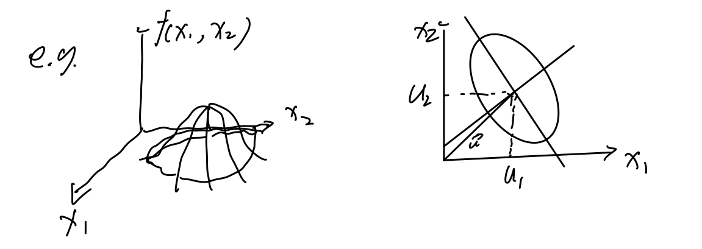

设随机向量$\mathbf{x}$服从多元正态分布，即$\mathbf{x} \sim \mathcal{N}(\mathbf{\mu}, \mathbf{\Sigma})$, 其中$\mathbf{x}$表示d维的向量，$\mathbf{\mu}$也表示d维的向量，$\mathbf{\Sigma}$表示dxd维的协方差矩阵。

随机向量$\mathbf{x}$的概率密度函数为：
$$f(\mathbf{x}) = \frac{1}{(2\pi)^{d/2}|\mathbf{\Sigma|^{1/2}}}e^{\frac{-1}{2}(\mathbf{x}-\mathbf{\mu})^T\mathbf{\Sigma}^{-1}(\mathbf{x}-\mathbf{\mu})} \quad \tag{1}$$

其中$\mathbf{\Sigma}^{-1}$是$\mathbf{\Sigma}$的逆矩阵，$|\mathbf{\Sigma}|$为其行列式。且有：
$$\mathbf{\mu} = E(\mathbf{x}) \quad \tag{2}$$
$$\mathbf{\Sigma} = E[(\mathbf{x}-\mathbf{\mu})(\mathbf{x}-\mathbf{\mu})^T] \quad \tag{3}$$

可知$\mathbf{\mu}=(\mu_1, \mu_2, \dots, \mu_d),\quad \mathbf{x} = (x_1, x_2, \dots, x_d)$，$\mu_i$是$\mathbf{\mu}$的第i个分量，$\sigma_{ij}$是$\mathbf{\Sigma}$的第i行第j列的元素。有
$$ \mu_i = E(x_i) = \int_{-\infin}^{+\infin} x_if(x_i)dx_i \quad \tag{4}$$
其中$f(x_i)$为边缘概率密度：
$$ f(x_i) = \int_{-\infin}^{+\infin} \dots \int_{-\infin}^{+\infin} f(\mathbf{x})dx_1dx_2\dots dx_{i+1}\dots dx_d \quad \tag{5}$$

且
$$ \sigma_{ij} = E\{(x_i-\mu_i)(x_j-\mu_j)\} \quad \tag{6}$$
$$=> \quad = \int_{-\infin}^{+\infin} \dots \int_{-\infin}^{+\infin}(x_i-\mu_i)(x_j-\mu_j)P(x_i, x_j)dx_idx_j \quad \tag{7}$$

协方差矩阵
$$ \mathbf{\Sigma} = \begin{pmatrix} 
\sigma_{11}, \sigma_{12}, \dots, \sigma_{1d} \\
\sigma_{21}, \sigma_{22}, \dots, \sigma_{2d} \\
\vdots, \quad \vdots, \dots,\quad  \vdots \\
\sigma_{n1}, \sigma_{n2}, \dots, \sigma_{nd}
\end{pmatrix} \quad \tag{8}$$

易知，协方差矩阵一定是对称矩阵，因为$\sigma_{ij}=\sigma_{ji}$。

### 2. 多元正态分布的性质
1. 参数$\mu$和$\mathbf{\Sigma}$对分布的决定性  

多元正态分布被均值向量$\mu$和协方差矩阵$\mathbf{\Sigma}$所完全确定。均值向量$\mu$由d个分量组成，协方差矩阵$\mathbf{\Sigma}$是对称阵，其独立元素只有d(d+1)/2个，所以多元正态分布是由d+d(d+1)/2个参数所完全确定。

2. 等密度点的轨迹为一超椭球面  

如果要使式（1）概率密度为一常数，即等密度，那么指数项必须是常数且不变，即$(\mathbf{x}-\mu)^T\mathbf{\Sigma}^{-1}(\mathbf{x}-\mu)=c$ ，有
$$ \gamma^2 = (\mathbf{x}-\mu)^T\mathbf{\Sigma}^{-1}(\mathbf{x}-\mu) \quad \tag{9}$$
上式被称作$\mathbf{x}$到$\mathbf{\mu}$的马氏距离的平方。所以等密度点轨迹是由$\mathbf{x}$到$\mu$的马氏距离为常数的超椭球面。

马氏距离：随机向量$\mathbf{x}$偏离均值向量$\mathbf{\mu}$的距离：
$$ \gamma = \sqrt{(\mathbf{x}-\mu)^T\mathbf{\Sigma}^{-1}(\mathbf{x}-\mu)} \quad \tag{10}
$$
马氏距离是衡量多个服从同一分布的随机向量的差异程度。  

在二维情况下，方程（9）的解是一个椭圆轨迹，其长短轴方向由协方差矩阵的特征向量决定；如下图：

样本的离散程度由$|\mathbf{\Sigma}|^{1/2}$决定；

3. 不相关性等价于独立性

若$x_i$和$x_j$相互独立，则一定不相关，且$P(x_i, x_j)=P(x_i)P(x_j)$;  
若$x_i$和$x_j$不相关，则不一定独立，因为这里说的是线性不相关而已，但对于正态分布，不相关一定独立。

4. 边缘分布和条件分布的正态性  

多元正态分布的边缘分布和条件分布仍然是正态分布。

5. 线性变换的正态性

多元随机向量的线性变换仍为多元正态分布的随机向量。
