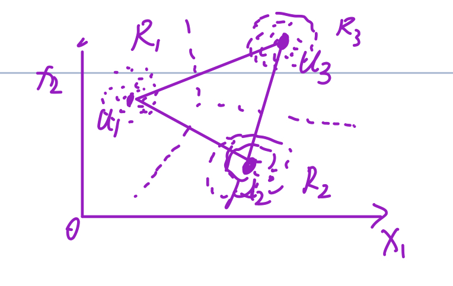
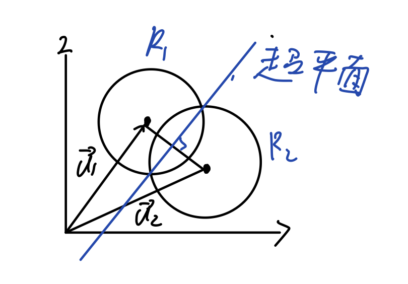
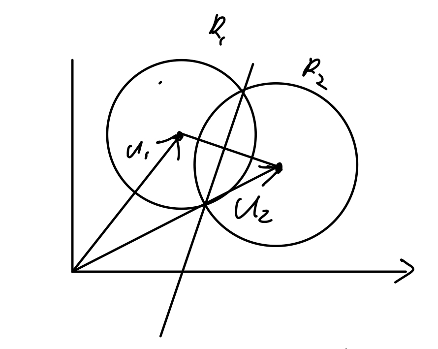

设某一类的样本的类条件概率服从多元正态分布，即
$$ P(\mathbf{x}|\omega_i) \sim \mathcal{N}(\mathbf{\mu_i}, \mathbf{\Sigma_i}) \quad (i=1,2,\dots,c) \tag{1}$$

定义该分布下的判别函数，判别函数的定义见[2.1节](https://blog.csdn.net/2301_79449205/article/details/134646696),
$$ g_i(\mathbf{x}) = \ln P(\mathbf{x}|\omega_i)P(\omega_i) $$
$$ => \quad = \ln P(\mathbf{x}|\omega_i) + \ln P(\omega_i) \tag{2}$$

注：这里专门采用了对数式判别函数，利于计算。

由于该类条件概率服从多元正态分布，所以可得：
$$ P(\mathbf{x}|\omega_i) = \frac{1}{(2\pi)^{d/2}|\mathbf{\Sigma_i}|^{1/2}}e^{\frac{-1}{2}}(\mathbf{x}-\mathbf{\mu_i})^T\mathbf{\Sigma}^{-1}_i(\mathbf{x}-\mathbf{\mu_i}) $$
判别函数：
$$=> \quad g_i(\mathbf{x}) = -\frac{1}{2}(\mathbf{x}-\mathbf{\mu_i})^T\mathbf{\Sigma}^{-1}(\mathbf{x}-\mathbf{\mu_i}) - \frac{d}{2}\ln2\pi - \frac{1}{2}\ln|\mathbf{\Sigma}_i|+\ln P(\omega_i) \tag{3}$$

定义第i类和第j类之间的决策面方程：
$$ g_i(\mathbf{x}) = g_j(\mathbf{x}) \tag{4}$$

将式（3）代入式（4）的方程中，可得：
$$-\frac{1}{2}[(\mathbf{x}-\mathbf{\mu_i})^T\mathbf{\Sigma}_i^{-1}(\mathbf{x}-\mathbf{\mu_i})-(\mathbf{x}-\mathbf{\mu}_j)^T\mathbf{\Sigma}^{-1}(\mathbf{x}-\mathbf{\mu}_j)] - \frac{1}{2}\ln\frac{|\mathbf{\Sigma}_i|}{|\mathbf{\Sigma}_j|}+\ln \frac{P(\omega_i)}{P(\omega_j)} = 0 \tag{5}$$

现在我们来考虑各类协方差矩阵以及类先验概率在不同情况下，判别函数的变化。  

### 一.第一种情况：$\mathbf{\Sigma}_i=\sigma^2I, i=1,2,\dots,c$

$I$是dxd维的单位矩阵，这种情况中每类的协方差矩阵都相等，而且类内各特征间相互独立（每个类别里样本的各特征间的协方差为0），每个特征具有相等的方差$\sigma^2$。下面进一步针对类别先验概率$P(\omega)$再分两种情况:  

（1） 先验概率$P(\omega_i) = P(\omega_j)$不相等  
可知
$$|\mathbf{\Sigma}_i|=\sigma^{2d} \tag{6}$$
$$\mathbf{\Sigma}_i^{-1} = \frac{1}{\sigma^2}I \tag{7}$$

将上述两式代入式（3）的判别函数中，得：
$$g_i(\mathbf{x}) = -\frac{(\mathbf{x}-\mathbf{\mu_i})^T(\mathbf{x}-\mathbf{\mu_i})}{2\sigma^2} - \frac{d}{2}\ln2\pi - d\ln\sigma+\ln P(\omega_i) \tag{8}$$

其中$-\frac{d}{2}\ln2\pi$和$-d\ln\sigma$和类别无关，可忽略
$$=> \quad g_i(\mathbf{x}) = -\frac{(\mathbf{x}-\mathbf{\mu_i})^T(\mathbf{x}-\mathbf{\mu_i})}{2\sigma^2} +\ln P(\omega_i) \tag{9}$$
其中
$$(\mathbf{x}-\mathbf{\mu_i})^T(\mathbf{x}-\mathbf{\mu_i})=||\mathbf{x}-\mathbf{\mu}_i||^2=\sum_{j=1}^d(x_j-\mu_{ij})^2,\quad i=1,\dots,c \tag{10}$$
这是$\mathbf{x}$到类$\omega_i$的样本均值向量$\mathbf{\mu}_i$的欧氏距离的平方。

（2） $P(\omega_i)=P(\omega_j)$  
现在每个类别的先验概率都相等，那么对判别函数式（9）就没什么影响了，可以忽略这一项，则
$$=> \quad g_i(\mathbf{x}) = -\frac{(\mathbf{x}-\mathbf{\mu_i})^T(\mathbf{x}-\mathbf{\mu_i})}{2\sigma^2}=-\frac{1}{2\sigma^2}||\mathbf{x}-\mathbf{\mu}_i||^2 \tag{11}$$
根据判别准则，我们要选择使判别函数最大的类别，即$\max g_i(\mathbf{x})  => \mathbf{x}\in \omega_i$，根据式（11）可得最大化$g_i(\mathbf{x})$就是最小化样本到各类均值向量的距离$\min ||\mathbf{x}-\mathbf{\mu}_i||^2$，这种分类器称为最小距离分类器。如图

除此之外，对于式（9），还可以继续化简，得：
$$=> \quad g_i(\mathbf{x}) = -\frac{(\mathbf{x}^T-\mathbf{\mu_i}^T)(\mathbf{x}-\mathbf{\mu_i})}{2\sigma^2} +\ln P(\omega_i) \tag{12}$$
$$=> \ = -\frac{1}{2\sigma^2}(\mathbf{x}^T\mathbf{x}-\mathbf{x}^T\mathbf{\mu}_i-\mathbf{\mu}_i^T\mathbf{x}+\mathbf{\mu}_i^T\mathbf{\mu}_i) +\ln P(\omega_i) \tag{13}$$

其中$\mathbf{x}^T\mathbf{x}$与类别i无关，且$\mathbf{x}^T\mathbf{\mu}_i=\mathbf{\mu}_i^T\mathbf{x}$, 则
$$=> \quad\ = -\frac{1}{2\sigma^2}(\mathbf{\mu}_i^T\mathbf{\mu}_i-2\mathbf{\mu}_i^T\mathbf{x}) +\ln P(\omega_i) \tag{14}$$
$$=> \quad = \frac{1}{\sigma^2}\mathbf{\mu}_i^T\mathbf{x} - \frac{1}{2\sigma^2}\mathbf{\mu}_i^T\mathbf{\mu}_i + \ln P(\omega_i) \tag{15}$$
$$=> \quad = \mathbf{w}_i^T\mathbf{x} + \omega_{i0} \tag{16} $$

可见我们得到了线性分类器，其中：$\mathbf{w}_i = \frac{1}{\sigma^2}\mathbf{\mu}_i \quad \omega_{i0}=- \frac{1}{2\sigma^2}\mathbf{\mu}_i^T\mathbf{\mu}_i + \ln P(\omega_i)$。  
决策规则就是要求对某个待分类的样本$\mathbf{x}$, 分别计算判别函数$g_i(\mathbf{x}), \quad i=1,\dots, c$，
$$若g_k(\mathbf{x}) = \max_i g_i(\mathbf{x}), \quad 则\mathbf{x}\in\omega_i \tag{17}$$

线性分类器的决策面是由线性方程$g_i(\mathbf{x}) = g_j(\mathbf{x})$所确定的一个超平面。将各自的判别函数代入该方程，我们可以得到：
$$(\mathbf{\mu}_i-\mathbf{\mu}_j)^T[\mathbf{x}-[\frac{\mathbf{\mu}_i+\mathbf{\mu}_j}{2}-\frac{\sigma^2}{(\mathbf{\mu}_i-\mathbf{\mu}_j)^T}\ln\frac{P(\omega_i)}{P(\omega_j)}]] = 0 \tag{18}$$
上式可化为，
$$\mathbf{w}^T(\mathbf{x}-\mathbf{x}_0) = 0 \tag{19}$$
其中
$$\quad \mathbf{w} = \mathbf{\mu}_i-\mathbf{\mu}_j \tag{20}$$
$$\mathbf{x}_0 = \frac{\sigma^2}{||\mathbf{\mu}_i-\mathbf{\mu}_j||^2}\ln\frac{P(\omega_i)}{P(\omega_j)}(\mathbf{\mu}_i-\mathbf{\mu}_j) \tag{21}$$

满足上式$\mathbf{x}$的轨迹构成了$\omega_i$与$\omega_j$类间的决策面，它是一个超平面，当$P(\omega_i)=P(\omega_j)$时，$\mathbf{x}_0=0$，此时超平面通过$\mathbf{\mu}_i$与$\mathbf{\mu}_j$连线中点，并与连线正交。如图：

可知这个决策面的方向是由$\mathbf{w}$决定的，位置由$\mathbf{x}_0$决定，所以决策面与先验概率相等时的决策面平行，当先验不相等时，向先验概率小的方向偏移，即先验概率大的一类要占据更大的决策空间。

### 二. 第二种情况：$\mathbf{\Sigma}_i = \mathbf{\Sigma}$

此时，各类别的协方差矩阵都相等，但是类内各样本的特征并不独立。判别函数为：
$$ g_i(\mathbf{x}) = -\frac{1}{2}(\mathbf{x}-\mathbf{\mu}_i)^T\mathbf{\Sigma}^{-1}(\mathbf{x}-\mathbf{\mu}_i) + \ln P(\omega_i) \tag{22}$$

若c类先验概率都相等，则判别函数可进一步化简为：
$$g_i(\mathbf{x}) = \gamma^2=(\mathbf{x}-\mathbf{\mu}_i)^T\mathbf{\Sigma}^{-1}(\mathbf{x}-\mathbf{\mu}_i) \tag{23}$$

这时决策规则为：为了对样本$\mathbf{x}$进行分类，只要计算出$\mathbf{x}$到每类的均值向量$\mathbf{\mu}_i$的Mahalanobis马氏距离的平方，最后把$\mathbf{x}$归于$\gamma^2$最小的类别。将式（22）进一步展开：
$$g_i(\mathbf{x}) = -\frac{1}{2}(\mathbf{x}^T\mathbf{\Sigma}^{-1}\mathbf{x}-\mathbf{x}^T\mathbf{\Sigma}^{-1}\mathbf{\mu}_i-\mathbf{\mu}_i^T\mathbf{\Sigma}^{-1}\mathbf{x}+\mathbf{\mu}_i^T\mathbf{\Sigma}^{-1}\mathbf{\mu}_i) + \ln P(\omega_i) \tag{24}$$
$$=>\quad = -\frac{1}{2}(\mathbf{x}^T\mathbf{\Sigma}^{-1}\mathbf{x}-2\mathbf{\mu}_i^T\mathbf{\Sigma}^{-1T}\mathbf{x}+\mathbf{\mu}_i^T\mathbf{\Sigma}^{-1}\mathbf{\mu}_i) + \ln P(\omega_i) \tag{25}$$
$$=>\quad = -\frac{1}{2}\mathbf{x}^T\mathbf{\Sigma}^{-1}\mathbf{x}+\mathbf{\mu}_i^T\mathbf{\Sigma}^{-1T}\mathbf{x}-\frac{1}{2}\mathbf{\mu}_i^T\mathbf{\Sigma}^{-1}\mathbf{\mu}_i + \ln P(\omega_i) \tag{26}$$
忽略其中与类别i无关的$\mathbf{x}^T\mathbf{\Sigma}^{-1}\mathbf{x}$项
$$=> \quad = \mathbf{\mu}_i^T\mathbf{\Sigma}^{-1T}\mathbf{x}-\frac{1}{2}\mathbf{\mu}_i^T\mathbf{\Sigma}^{-1}\mathbf{\mu}_i + \ln P(\omega_i) \tag{27}$$
$$=> \quad =\mathbf{w}_i^T\mathbf{x}+\omega_{i0} \tag{28}$$
其中
$$\mathbf{w}_i = \mathbf{\Sigma}^{-1}\mathbf{\mu}_i \\
\omega_{i0} = -\frac{1}{2}\mathbf{\mu}_i^T\mathbf{\Sigma}^{-1}\mathbf{\mu}_i + \ln P(\omega_i) \tag{29}$$

可见这种情况依然是$\mathbf{x}$的线性判别函数，因此决策面仍是一个超平面，若决策域$R_i$与$R_j$相邻，则决策面方程为：
$g_i(\mathbf{x})=g_j(\mathbf{x})$,可化简为
$$\mathbf{w}^T(\mathbf{x}-\mathbf{x}_0)=0\tag{30}$$ 
 其中
$$\mathbf{w}=\mathbf{\Sigma}^{-1}(\mathbf{\mu}_i-\mathbf{\mu}_j) \tag{31}$$
$$\mathbf{x}_0 = \frac{1}{2}(\mathbf{\mu}_i+\mathbf{\mu}_j)-\frac{1}{(\mathbf{\mu}_i-\mathbf{\mu}_j)^T\mathbf{\Sigma}^{-1}(\mathbf{\mu}_i-\mathbf{\mu}_j)}\ln \frac{P(\omega_i)}{P(\omega_j)}(\mathbf{\mu}_i-\mathbf{\mu}_j) \tag{32}$$

对比式（20）和（21），差别就在于$\mathbf{\Sigma}_i$的不同。决策面为满足上式（30）的$\mathbf{x}$的轨迹构成了$\omega_i$与$\omega_j$类之间的决策面，决策面过$\mathbf{x}_0$，当$P(\omega_i)=P(\omega_j)$时，该超平面过$\frac{\mathbf{\mu}_i+\mathbf{\mu}_j}{2}$。如图：

这里超平面不与两均值向量的连线正交，因为$\mathbf{w}=\mathbf{\Sigma}^{-1}(\mathbf{\mu}_i-\mathbf{\mu}_j)$，除非$\mathbf{\Sigma}=I$

### 总结
* 在多元正态分布的条件下，基于最小错误率贝叶斯决策只要能做到各类别的协方差矩阵是一样的，那么无论先验概率是否相等，都可以用线性分界面实现。 

* 最小（欧氏）距离分类器则要求各正态分布的协方差矩阵为单位矩阵，且各类别的先验概率相等。

### 三. 第三种情况各类的协方差矩阵互不相等

此时判别函数为$\mathbf{x}$的二次型，表示超二次曲面。
