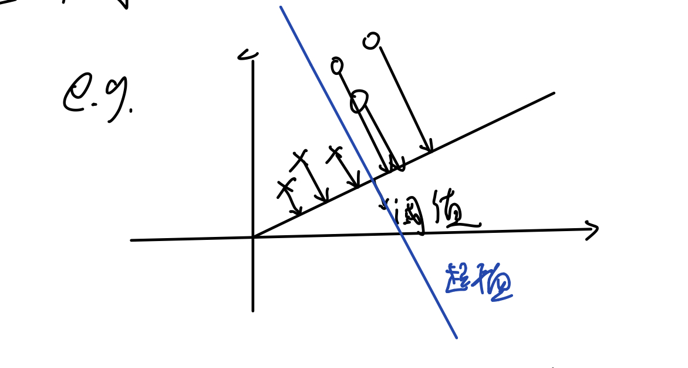

# Linear Discriminant Analysis
* 目标：处理两类**线性**判别问题
* 思想：对于两类的线性判别问题，可以看作是把所有样本都投影到某一个方向上，然后在沿着这个方向上的一维空间中确定一个分类的阈值，过这个阈值点且与投影方向垂直的超平面就是两类的分类面。

  

* 问题：如何找到这个超平面，=> 即如何确定投影方向？  
  
背景描述：  
设样本集为$\mathscr{X} = \{ \mathbf{x}_{1}, \mathbf{x}_{2}, ... \mathbf{x}_{n}\}$, 其中$\mathbf{x}_{i}$是样本集中的第i个**d维向量**, 代表一个样本，包含d个特征，属于某一类$\omega$  
比如其中$\omega_{1}$类的样本集是$\mathscr{X}_{1}=\{\mathbf{x}^1_1, \mathbf{x}^1_2, ..., \mathbf{x}^1_n\}$, $\omega_{2}$类的样本集是$\mathscr{X}_{2}=\{\mathbf{x}^2_1, \mathbf{x}^2_2, ..., \mathbf{x}^2_n\}$  
  
核心思想：将d维的样本投射到一维空间中，方便分类；  
确定一个投影方向$\mathbf{w}$(d维向量), 使得$y_i=\mathbf{w}^T\mathbf{x}_i$, (1xd*dx1=1, $y_i$是一个值)，这个式子是将样本$\mathbf{x}_i$投影到$\mathbf{w}$方向上。  
  
对于第i类的样本空间：其均值向量为$$\mathbf{m}_i=\frac{1}{N_i} \sum\limits_{\mathbf{x}_j \in \mathscr{X}_i} \mathbf{x}_j\quad,\quad i=1, 2 \tag{1}$$
$\mathbf{m}_i$是d维向量  
$$\mathbf{m}_i=\frac{1}{N_i}\begin{pmatrix} \begin{pmatrix} x_{11} \\ x_{12} \\ \vdots \\ x_{1d} \end{pmatrix} + \begin{pmatrix} x_{21} \\ x_{22} \\ \vdots \\ x_{2d} \end{pmatrix} + \dots + \begin{pmatrix} x_{N_i1} \\ x_{N_i2} \\ \vdots \\ x_{N_id} \end{pmatrix} \end{pmatrix} = \begin{pmatrix} \mu_1 \\ \mu_2 \\ \vdots \\ \mu_d \end{pmatrix}$$
上式中每一列向量代表具有d个特征的第i类的一个样本。对于两类问题我们可以得到第一类的均值向量$\mathbf{m}_1$和第二类的均值向量$\mathbf{m}_2$  
  
定义各类的类内离散度矩阵（within-class scatter matrix）为
$$\mathbf{S}_i=\sum\limits_{\mathbf{x}_j \in \mathscr{X}_i} (\mathbf{x}_j-\mathbf{m}_i)(\mathbf{x}_j-\mathbf{m}_i)^T, \quad i=1,2 \tag{2}$$
其中$\mathbf{S}_i$是dxd的矩阵。 在二分类的条件下有两个，第一个类别中的样本离散度矩阵$\mathbf{S}_1$和第二个类别中的样本离散度矩阵$\mathbf{S}_2$，它们分别表示每个类别内部所有样本的离散程度。这是**类内**的离散程度，我们希望类内之间的样本集中一点，这样就好划分。总的类内离散度就是两类各自的离散度之和：$$\mathbf{S}_w=\mathbf{S}_1+\mathbf{S}_2 \tag{3}$$    
**注意：$\mathbf{S}_i$不是协方差矩阵，方差是平均偏差，这里的$\mathbf{S}_i$是代表累计偏差，没有除以总数平均化。**
* 注：离散度矩阵与协方差矩阵有如下关系：  
离散度矩阵= $$\mathbf{S}_i=\sum\limits_{\mathbf{x}_j \in \mathscr{X}_i} (\mathbf{x}_j-\mathbf{m}_i)(\mathbf{x}_j-\mathbf{m}_i)^T$$ 而协方差矩阵= $$\Sigma_i=\frac{1}{N_i-1}\mathbf{S}_i$$  
在LDA分析中，通常用离散度矩阵

总的类内离散度为$\mathbf{S}_w$已经知道了，那类与类之间的离散度如何刻画了，就是类与类之间的偏离程度，我们希望它们偏离程度越大越好，这样便于分类，如果集中在一起就没法分了。所以我们选择各类内中的样本均值向量之间的距离来刻画类间的分离程度。即类间离散度矩阵（between-class scatter matrix) $$\mathbf{S}_b=(\mathbf{m}_1-\mathbf{m}_2)(\mathbf{m}_1-\mathbf{m}_2)^T \tag{4}$$
$\mathbf{S}_b$是dxd的矩阵，代表两类均值离散度。  

以上所计算的各类样本均值$\mathbf{m}$, 各类样本类内离散度$\mathbf{S}_i$, 总的类内离散度$\mathbf{S}_w$, 以及类别之间的类间离散度$\mathbf{S}_b$, 这些都是对d维向量计算得到的向量或矩阵。接下来，经过$y_i=\mathbf{w}^T\mathbf{x}_i$这个运算将d维样本$\mathbf{x}_i$投影到了一维空间，对应的样本为$y_i$  
在投影以后的一维空间，两类的均值分别为
$$\tilde{m}_i=\frac{1}{N_i}\sum\limits_{y_j\in\mathscr{Y_i}}y_j \\
=\frac{1}{N_i}\sum\limits_{\mathbf{x}_j\in\mathscr{X}_i}\mathbf{w}^T\mathbf{x}\\
=\mathbf{w}^T.\frac{1}{N_i}\sum\limits_{\mathbf{x}_j\in\mathscr{X}_i}\mathbf{x}_j\\
=\mathbf{w}^T\mathbf{m}_i \quad i=1,2 \tag{5}
$$
类内离散度不再是一个矩阵，而是一个值
$$\tilde{S}^2_i=\sum\limits_{y_j \in \mathscr{Y}_i}(y_j-m_i)^2 \quad i=1, 2 \tag{6}$$
同理这里我们得到两个类别的类内离散度（在一维空间下了），$\tilde{S}^2_1$和$\tilde{S}^2_2$, 由此推出总类内离散度
$$\tilde{S}^2_w=\tilde{S}^2_1+\tilde{S}^2_2 \tag{7}$$

而类间离散度就成为两类在一维空间之下的均值之差的平方：
$$\tilde{S}_b=(\tilde{m}_1-\tilde{m}_2)^2 \tag{8}$$

准则：**投影方向使投影以后的两类尽可能分开，而各类内部又尽可能聚集**
$$\max J_F(\mathbf{w})=\frac{\tilde{S}_b}{\tilde{S}_w}=\frac{(\tilde{m}_1-\tilde{m}_2)^2}{\tilde{S}^2_1+\tilde{S}^2_2} \tag{9}$$

式（9）就是**Fisher准则函数（Fisher‘s Criterion）**
我们希望分子更大一些，分母更小一点，以此最大化该函数。  
继续化简一下分子：
$$\tilde{S}_b=(\tilde{m}_1-\tilde{m}_2)^2=(\frac{1}{N_1}\sum\limits_{y_i \in \mathscr{Y}_1}y_i-\frac{1}{N_2}\sum\limits_{y_i \in \mathscr{Y}_2}y_i)^2 \\
=(\mathbf{w}^T\mathbf{m}_1-\mathbf{w}^T\mathbf{m}_2)^2=(\mathbf{w}^T(\mathbf{m}_1-\mathbf{m}_2))^2\\
=\mathbf{w}^T(\mathbf{m_1}-\mathbf{m}_2)(\mathbf{m_1}-\mathbf{m}_2)^T\mathbf{w}=\mathbf{w}^T\mathbf{S}_b\mathbf{w} \tag{10}$$

同理化简分母$\tilde{S}_w$:
$$\tilde{S}_w=\tilde{S}^2_1+\tilde{S}^2_2 \\
=\sum\limits_{y_i\in\mathscr{Y}_1}(y_i-\tilde{m}_1)^2 + \sum\limits_{y_i\in\mathscr{Y}_2}(y_i-\tilde{m}_2)^2 \\
=\sum\limits_{\mathbf{x}_i\in\mathscr{X}_1}(\mathbf{w}^T\mathbf{x}_i-\mathbf{w}^T\mathbf{m}_1)^2+\sum\limits_{\mathbf{x}_i\in\mathscr{X}_2}(\mathbf{w}^T\mathbf{x}_i-\mathbf{w}^T\mathbf{m}_2)^2\\
=\mathbf{w}^T\sum\limits_{\mathbf{x_i}\in\mathscr{X}_1}(\mathbf{x}_i-\mathbf{m}_1)(\mathbf{x}_i-\mathbf{m}_1)^T\mathbf{w}+\mathbf{w}^T\sum\limits_{\mathbf{x_i}\in\mathscr{X}_2}(\mathbf{x}_i-\mathbf{m}_2)(\mathbf{x}_i-\mathbf{m}_2)^T\mathbf{w}\\
=\mathbf{w}^T\mathbf{S}_1\mathbf{w}+\mathbf{w}^T\mathbf{S}_2\mathbf{w}\\
=\mathbf{w}^T\mathbf{S}_w\mathbf{w} \tag{11}$$

根据上述化简的式子，推出Fisher判别准则函数可以写成：
$$\max J_F(\mathbf{w})=\frac{\mathbf{w}^T\mathbf{S}_b\mathbf{w}}{\mathbf{w}^T\mathbf{S}_w\mathbf{w}} \tag{12}$$

目标是最大化式（12），即使分子尽量大，分母尽量小点；  
设类内离散度一定，即分母一定，设为常数c，最大化类间离散度。即把式（12）转化成如下优化问题：
$$\max \quad \mathbf{w}^T\mathbf{S}_b\mathbf{w} \\
s.t. \quad \mathbf{w}^T\mathbf{S}_w\mathbf{w}=c\neq0 \tag{13}$$

这是一个等式约束下的极值问题，可以通过引入拉格朗日乘子转化成以下拉格朗日函数的无约束极值问题：
$$L(\mathbf{w}, \lambda)=\mathbf{w}^T\mathbf{S}_b\mathbf{w}-\lambda(\mathbf{w}^T\mathbf{S}_w\mathbf{w}-c) \tag{14}$$

接下来，就是对式（14）求极值，对$\mathbf{w}$求偏导，令其等于0，找出驻点即可。
$$\frac{\partial{L(\mathbf{w}, \lambda)}}{\partial{\mathbf{w}}}=0 \\$$

$$=> 2\mathbf{S}_b\mathbf{w}-2\lambda\mathbf{S}_w\mathbf{w}=0 \\$$
$$=> \mathbf{S}_b\mathbf{w}- \lambda\mathbf{S}_w\mathbf{w}=0 \\$$
$$=> \mathbf{S}_b\mathbf{w}=\lambda\mathbf{S}_w\mathbf{w} \tag{15}$$

假设$\mathbf{S}_w$可逆，
$$=>\mathbf{S}^{-1}_w\mathbf{S}_b\mathbf{w}=\lambda\mathbf{w} \tag{16}$$

根据式（16）可以看出投影向量$\mathbf{w}$是矩阵$\mathbf{S}^{-1}_w\mathbf{S}_b$的特征向量，特征值为$\lambda$

将$\mathbf{S}_b=(\mathbf{m}_1-\mathbf{m}_2)(\mathbf{m}_1-\mathbf{m}_2)^T$代入式（16）得：
$$\lambda\mathbf{w}=\mathbf{S}^{-1}_w(\mathbf{m}_1-\mathbf{m}_2)(\mathbf{m}_1-\mathbf{m}_2)^T\mathbf{w} \tag{17}$$

观察式（17）的等式右边最后两项因子$(\mathbf{m}_1-\mathbf{m}_2)^T\mathbf{w}$, 这里是两个向量相乘，1xd*dx1=一个值，故$\mathbf{w}$的方向是由$\mathbf{S}^{-1}_w(\mathbf{m}_1-\mathbf{m}_2)$决定的。  
因为我们只关心$\mathbf{w}$的方向，所以可取：
$$\mathbf{w}=\mathbf{S}^{-1}_w(\mathbf{m}_1-\mathbf{m}_2) \tag{18}$$

这就是Fisher判别准则下的最优投影方向。  
注： Fisher判别函数最优的解本身只是给出了一个投影方向，并没有给出我们需要的分类面（和投影方向正交），需要在投影方向上确定一个分类阈值$\omega_0$
